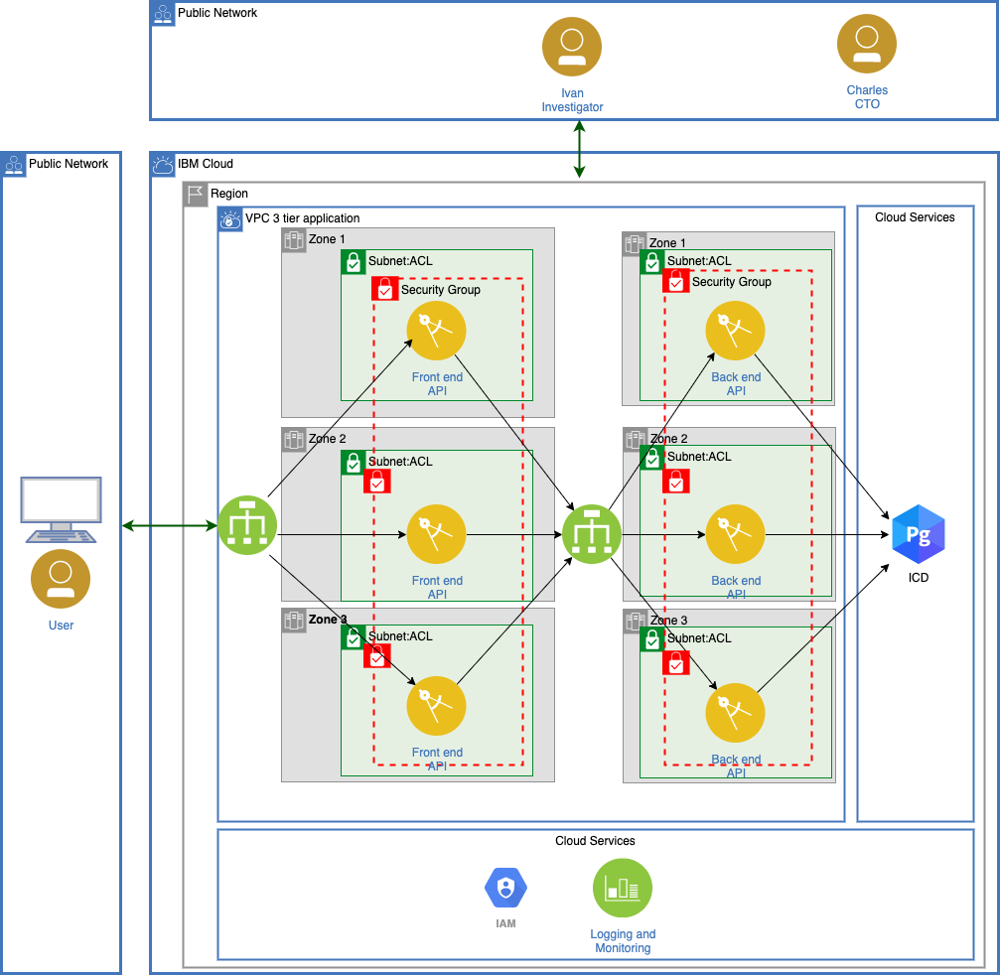

# IBM VPC 3 Tier Testing Application

An iteration of a demo scenario to showcase current state of a three tier application.


[Implementation Notes](implementation.md)

An iteration of a demo scenario to showcase current state of a three tier application.

## Introduction

This scenario demonstrates the technology investigation phase of a new corporate customer.  "Charles" the CTO asked "Ivan" the Investigator to look into the IBM cloud.  Ivan will determine if IBM is a viable choice.  He has verified that the MZR world wide coverage map meets his world wide coverage requirements.  He will create or port a 3 tier application to VPC instances, distributed over three AZs, using VPC load balancers in a single region. 

Personas:
- Ivan the investigator (focus of this scenario)
- Charles the CTO

Ivan will put together the system using the IBM cloud's features:
- Cloud console to explore, test, learn and verify
- Infrastructure as Code, command line, and python will be used express the three tier prototype.  This will allow changes to be applied during the evaluation period and easily apply changes like Security Group, t-shirt sizes, etc over the entire architecture.
- Postgresql will serve as an example of an open source service that is fully managed (understand integration with IAM, backup/restore, HA, ...)

Infrastructure as a Service (IAAS) networking and compute is expected to perform similar to competition. During the construction Ivan will produce some simple tests to verify the working system and allow changes to be applied.  Platform logging and metrics will be enabled and examined

## Architecture

The following architecture is deployed with this template:


## Compatibility

- Terraform 0.14 and above.
- IBM Cloud Terraform provider 1.41.1 and above

## Running this template

### IBM Cloud API Key

The *ibmcloud_api_key* terraform variable must be generated prior to running this template. Please refer to [IBM Cloud API Key](https://www.ibm.com/docs/en/app-connect/containers_cd?topic=servers-creating-cloud-api-key)

### Deployment Location

The following variables dictate the location of the deployent.

```hcl
variable "ibmcloud_vpc_region" {
  description = "Enter the target Region of IBM Cloud"
  default = "eu-de"
}

variable "vpc_zone" {
  description = "VPC Zone"
  default     = "eu-de-1"
}
```

### SSH Key

An ssh key is required to provision a vsi instance. If the ibm_is_ssh_key variable is left blank, then terraform will generate an ssh key for use in the deployment.

```hcl
data "ibm_is_ssh_key" "ssh_key" {
  count = var.ssh_key_name != "" ? 1 : 0
  name = var.ssh_key_name
}

resource "tls_private_key" "ssh" {
  algorithm = "RSA"
  rsa_bits  = 4096
}

```

### Application endpoint post-deployment

The endpoint address is generated via a terraform output.

```hcl
output "lb_front" {
  value = "http://${ibm_is_lb.front.hostname}:8000"
}
```
